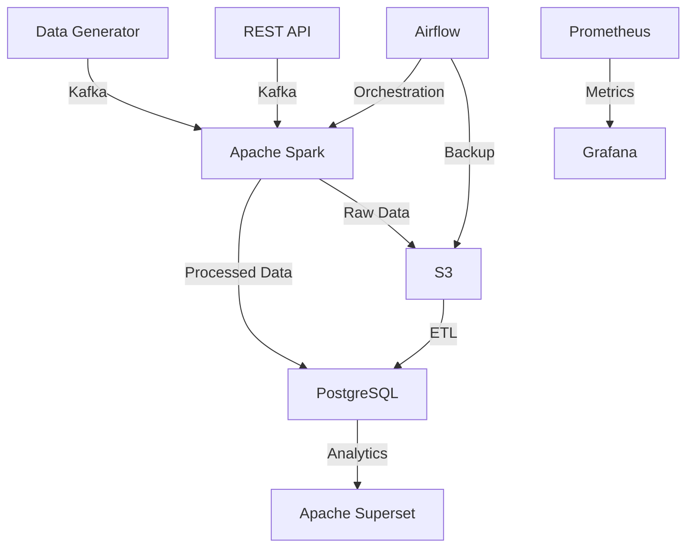

# Real-Time Retail Data Pipeline

A comprehensive real-time analytics system for retail data processing, demonstrating advanced data engineering skills and best practices.

## 🏗️ Architecture



## 🛠️ Tech Stack

- **Data Ingestion**: Kafka + FastAPI
- **Data Processing**: Apache Spark (Structured Streaming)
- **Data Storage**: 
  - PostgreSQL (OLTP)
  - S3 (Data Lake)
  - Redshift (OLAP)
- **Orchestration**: Apache Airflow
- **Visualization**: Apache Superset
- **Monitoring**: Prometheus + Grafana
- **DevOps**: Docker, GitHub Actions
- **Cloud**: AWS (EC2, S3, RDS, MSK)

## 📁 Project Structure

```
retail-realtime-data-engineering/
│
├── data-generator/             # Python scripts to simulate data
├── kafka-setup/                # Kafka + Docker setup
├── spark-jobs/                 # ETL jobs (structured streaming)
├── airflow-dags/               # DAGs for daily/weekly tasks
├── infra/                      # Terraform or AWS setup
├── dashboards/                 # Superset/Power BI JSON configs
├── notebooks/                  # Analysis, model training
├── docker-compose.yml
├── requirements.txt
└── README.md
```

## 🚀 Getting Started

### Prerequisites

- Docker and Docker Compose
- Python 3.8+
- AWS CLI (for cloud deployment)
- Terraform (optional)

### Local Development Setup

1. Clone the repository:
```bash
git clone https://github.com/yourusername/realtime-retail-data-pipeline.git
cd realtime-retail-data-pipeline
```

2. Create and activate a virtual environment:
```bash
python -m venv venv
source venv/bin/activate  # On Windows: .\venv\Scripts\activate
```

3. Install dependencies:
```bash
pip install -r requirements.txt
```

4. Copy the example environment file and update it:
```bash
cp .env.example .env
# Edit .env with your configuration
```

5. Start the local development environment:
```bash
docker-compose up -d
```

## 📊 Features

- Real-time transaction processing
- Inventory level monitoring
- Fraud detection
- Sales analytics dashboard
- Data quality monitoring
- Automated ETL pipelines

## 🔄 CI/CD Pipeline

The project uses GitHub Actions for continuous integration and deployment:
- Automated testing
- Code quality checks
- Docker image building
- Infrastructure deployment

## 📈 Monitoring

- Kafka lag monitoring
- Spark job metrics
- Data quality metrics
- System health checks

## 🤝 Contributing

1. Fork the repository
2. Create a feature branch (`git checkout -b feature/amazing-feature`)
3. Commit your changes (`git commit -m 'Add some amazing feature'`)
4. Push to the branch (`git push origin feature/amazing-feature`)
5. Open a Pull Request

### Development Guidelines

- Follow PEP 8 style guide for Python code
- Write unit tests for new features
- Update documentation for any changes
- Use meaningful commit messages
- Keep the code DRY (Don't Repeat Yourself)

### Code Review Process

1. All pull requests require at least one review
2. CI checks must pass
3. Code coverage should not decrease
4. Documentation must be updated

## 📝 License

This project is licensed under the MIT License - see the LICENSE file for details.

## 🙏 Acknowledgments

- Apache Kafka
- Apache Spark
- Apache Airflow
- PostgreSQL
- Prometheus & Grafana
- Docker
- AWS