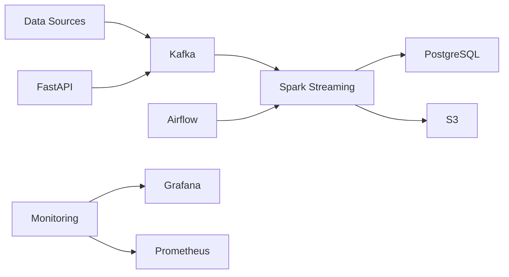

# Real-Time Retail Data Pipeline

A comprehensive real-time data pipeline for retail analytics, built with modern technologies and best practices.

## Architecture Overview



## Components

### 1. Data Ingestion
- **Data Generator**: Simulates retail transactions and inventory updates
- **FastAPI Service**: REST API for real-time data ingestion
- **Kafka**: Message broker for event streaming

### 2. Data Processing
- **Spark Streaming**: Real-time data processing and analytics
- **Airflow**: Workflow orchestration and batch processing
- **PostgreSQL**: Transactional data storage
- **S3**: Data lake for historical analysis

### 3. Monitoring & Quality
- **Prometheus**: Metrics collection
- **Grafana**: Real-time dashboards
- **Great Expectations**: Data quality validation

## Getting Started

### Prerequisites
- Python 3.8+
- Docker and Docker Compose
- Apache Kafka
- Apache Spark
- PostgreSQL
- AWS Account (for S3)

### Installation

1. Clone the repository:
```bash
git clone https://github.com/yourusername/realtime-retail-data-pipeline.git
cd realtime-retail-data-pipeline
```

2. Install dependencies:
```bash
pip install -r requirements.txt
```

3. Configure environment variables:
```bash
cp .env.example .env
# Edit .env with your configuration
```

4. Start the services:
```bash
docker-compose up -d
```

## End-to-End Demo

This section provides step-by-step instructions to run the entire retail data pipeline locally, from data generation to monitoring.

### 1. Prerequisites
- Docker & Docker Compose installed
- Python 3.8+
- (Optional) AWS credentials for S3 integration

### 2. Clone the Repository
```bash
git clone https://github.com/yourusername/realtime-retail-data-pipeline.git
cd realtime-retail-data-pipeline
```

### 3. Start All Services
```bash
docker-compose up -d
```
This will start Kafka, Zookeeper, PostgreSQL, Prometheus, and Grafana.

### 4. Start Airflow
- Follow instructions in `airflow-dags/README.md` 

# Example (if using docker-compose for Airflow)
cd airflow-dags
docker-compose up -d
```

### 5. Generate Sample Data
```bash
python data-generator/generate_retail_data.py
```
This will send simulated transactions and inventory updates to Kafka.

### 6. Start Spark Streaming Job
```bash
spark-submit --master local[2] spark-jobs/process_retail_stream.py
```

### 7. Monitor the Pipeline
- **Grafana Dashboard:** [http://localhost:3000](http://localhost:3000)
- **Prometheus:** [http://localhost:9090](http://localhost:9090)
- **Airflow UI:** [http://localhost:8080](http://localhost:8080)

### 8. Run Data Quality Checks
- Trigger the Airflow DAG for data quality, or run Great Expectations manually:
```bash
great_expectations checkpoint run retail_transactions
```

### 9. Run Tests
```bash
pytest tests/
```

You now have a fully running end-to-end retail data pipeline, with real-time ingestion, processing, quality checks, and monitoring.

## Usage

### Data Generation
```bash
python data-generator/generate_retail_data.py
```

### API Endpoints
- `POST /transactions/`: Create new transaction
- `POST /inventory/`: Update inventory
- `GET /health`: Health check

### Monitoring
- Grafana Dashboard: http://localhost:3000
- Prometheus: http://localhost:9090

## Development

### Project Structure
```
.
├── api/                    # FastAPI application
├── data-generator/         # Data simulation
├── spark-jobs/            # Spark streaming jobs
├── airflow-dags/          # Airflow workflows
├── monitoring/            # Prometheus & Grafana
├── tests/                 # Test suite
└── docs/                  # Documentation
```

### Testing
```bash
pytest tests/
```

### CI/CD
The project uses GitHub Actions for continuous integration and deployment:
- Automated testing
- Code quality checks
- Docker image building
- AWS deployment

## Data Quality

### Validation Rules
- Transaction ID format: `TXN[timestamp][random]`
- Product ID format: `P[0-9]{3}`
- Customer ID format: `CUST[0-9]{4}`
- Amount validation
- Store location validation
- Payment method validation

### Monitoring Metrics
- Transaction rate
- Inventory levels
- Fraud detection
- API performance
- Data quality scores

## Contributing

1. Fork the repository
2. Create a feature branch
3. Commit your changes
4. Push to the branch
5. Create a Pull Request

## License

This project is licensed under the MIT License - see the [LICENSE](LICENSE) file for details.

## Support

For support, please open an issue in the GitHub repository or contact the maintainers.