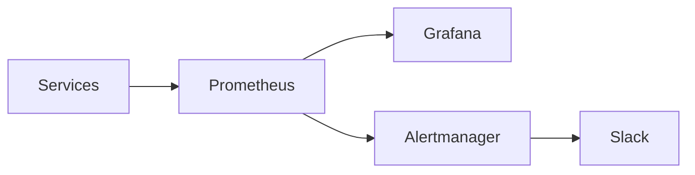

# Monitoring Documentation

## Overview

The retail data pipeline uses Prometheus for metrics collection and Grafana for visualization. This setup provides real-time monitoring of system health, performance, and business metrics.

## Architecture



## Metrics Collection

### Prometheus Configuration

The Prometheus server is configured to scrape metrics from various services:

```yaml
global:
  scrape_interval: 15s
  evaluation_interval: 15s

scrape_configs:
  - job_name: 'retail-api'
    static_configs:
      - targets: ['api:8000']
    metrics_path: '/metrics'

  - job_name: 'kafka'
    static_configs:
      - targets: ['kafka:9090']

  - job_name: 'spark'
    static_configs:
      - targets: ['spark-master:4040']
```

### Key Metrics

#### API Metrics
- Request latency
- Request count by endpoint
- Error rate
- Response time percentiles

#### Kafka Metrics
- Message rate
- Consumer lag
- Topic size
- Partition count

#### Spark Metrics
- Job duration
- Stage completion
- Memory usage
- Executor status

#### System Metrics
- CPU usage
- Memory usage
- Disk I/O
- Network traffic

## Dashboards

### Retail Metrics Dashboard

The main dashboard (`retail_metrics.json`) includes:

1. **Transaction Rate by Store**
   - Line graph showing transaction rate
   - Grouped by store location
   - 5-minute rate

2. **Total Sales by Payment Method**
   - Stacked area chart
   - Sales amount by payment method
   - Daily totals

3. **Inventory Levels by Product**
   - Line graph
   - Current inventory levels
   - Low stock alerts

4. **Fraudulent Transaction Rate**
   - Line graph
   - Fraud rate over time
   - Alert threshold

### System Health Dashboard

1. **Service Status**
   - Health check status
   - Error rates
   - Response times

2. **Resource Usage**
   - CPU/Memory usage
   - Disk space
   - Network traffic

3. **Pipeline Performance**
   - Processing latency
   - Queue sizes
   - Error counts

## Alerts

### Alert Rules

```yaml
groups:
  - name: retail_alerts
    rules:
      - alert: HighErrorRate
        expr: rate(http_requests_total{status=~"5.."}[5m]) > 0.1
        for: 5m
        labels:
          severity: critical
        annotations:
          summary: High error rate detected
          description: Error rate is above 10% for 5 minutes

      - alert: HighLatency
        expr: http_request_duration_seconds{quantile="0.9"} > 1
        for: 5m
        labels:
          severity: warning
        annotations:
          summary: High latency detected
          description: 90th percentile latency is above 1 second
```

### Alert Channels

1. **Slack**
   - Critical alerts
   - Daily summaries
   - On-call notifications

2. **Email**
   - Weekly reports
   - Trend analysis
   - Capacity planning

## Best Practices

### Monitoring

1. **Metric Collection**
   - Use appropriate scrape intervals
   - Label metrics properly
   - Avoid high cardinality

2. **Dashboard Design**
   - Keep dashboards focused
   - Use appropriate visualizations
   - Include context and thresholds

3. **Alerting**
   - Set meaningful thresholds
   - Avoid alert fatigue
   - Include runbooks

### Maintenance

1. **Regular Tasks**
   - Review alert thresholds
   - Update dashboards
   - Clean up old metrics

2. **Performance**
   - Monitor Prometheus storage
   - Optimize queries
   - Manage retention

## Troubleshooting

### Common Issues

1. **Missing Metrics**
   - Check service health
   - Verify scrape config
   - Check network connectivity

2. **High Latency**
   - Check system resources
   - Review query patterns
   - Optimize PromQL

3. **Alert Issues**
   - Verify alert rules
   - Check notification channels
   - Review alert history

### Support

For monitoring issues:
1. Check Prometheus targets
2. Review Grafana logs
3. Contact DevOps team 